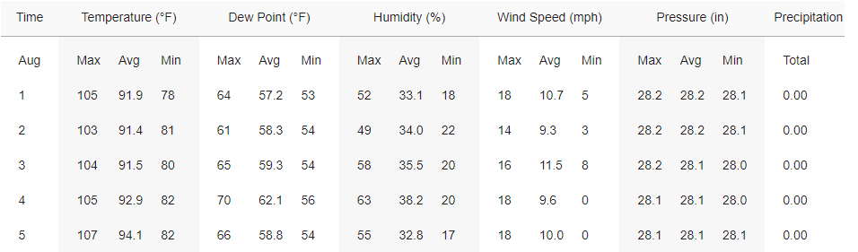
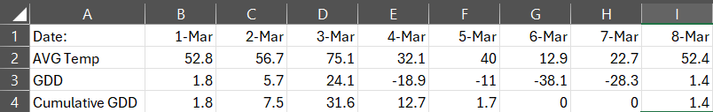

# Growing Degree Days

In this project, we are going to implement several classes to create a small application to calculate the day on which certain heat thresholds were reached.

Daily Weather for August 1-5, 2023 in Abilene TX:

## Definitions:

Growing Degree Day: For a given day, the GDD is the average daily temperature minus a crop-specific threshold.  For example, for grapes, the threshold for growth is 51 degrees farenheit. On August 1, 2023, the average daily temperature was 91.9 degrees.  So, the GDD for August 1 is 91.91 - 51, or 40.91. 

Cumulative GDD: The cumulative GDD is the sum of all Growing Degree Days up to that point in the year, except that CGDD can never fall below zero--plants can't "ungrow", they just resume hibernation if the temperature is too low.

For example, here is a chart of GDD and Cumulative GDD for a fictional month of march, using a threshold of 51 degrees:

## Your Assignment

You have been given some partially completed code, and some unit tests.
This project has been set up to use Gradle for building and testing.
You can either run gradlew commands from the command line, or use Gradle functionality
    built in to your favorite ide.

Step 1 -
    Search for the "TODO" sections in the GrowingDays.java file\
    Complete the code so that the tests in GrowingDaysTests will pass\
    `./gradlew test --tests edu.hsutx.GrowingDaysTest`

Step 2-
    Search for the "TODO" sections in CircularLL.java file\
    Complete the code so that the tests in CircularLLTest will pass\
    `./gradlew test --tests edu.hsutx.CircularLLTest`

Step 3-
    build the entire project.
    `./gradlew build`

Run the Main class and confirm it is working.\
Sample correct output for input "2000" is 172 and Wednesday\
Note that gradle does not handle standard input well, so you won't be able to successfully run main() using gralde